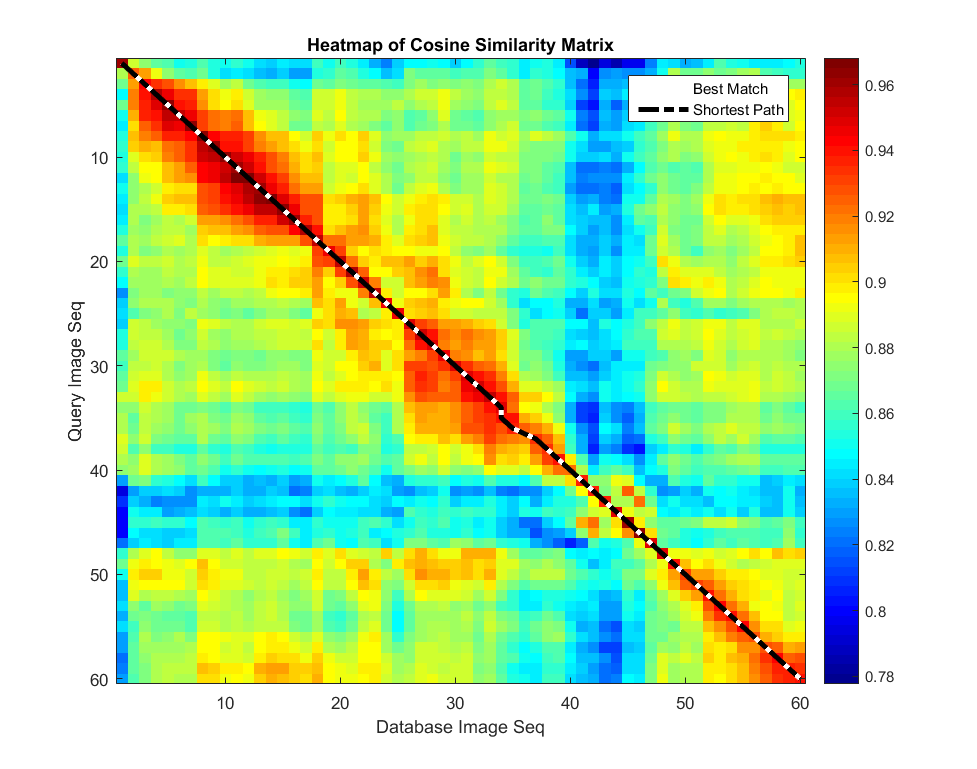
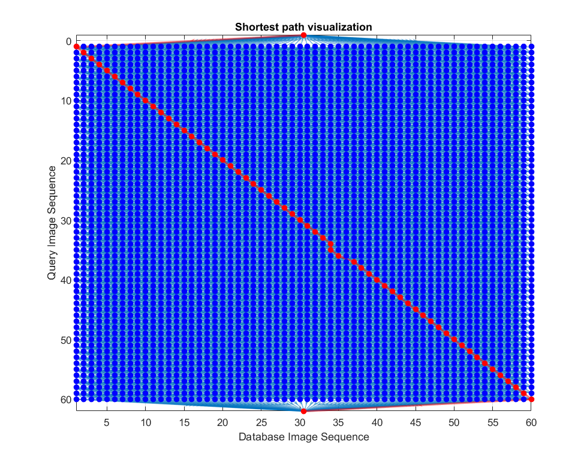
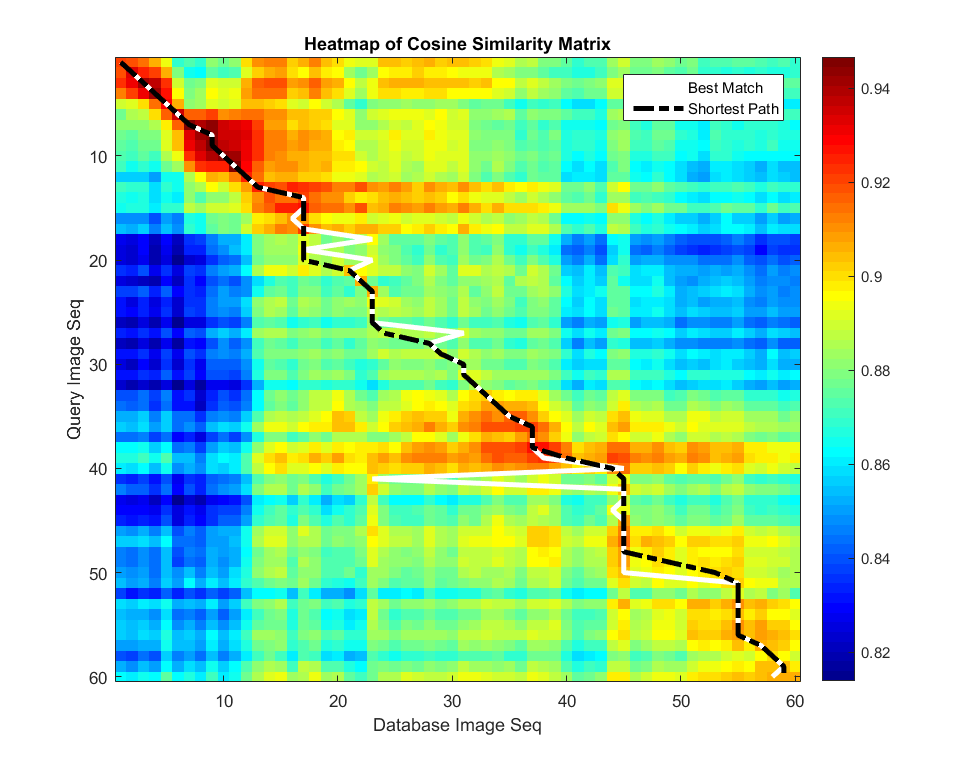
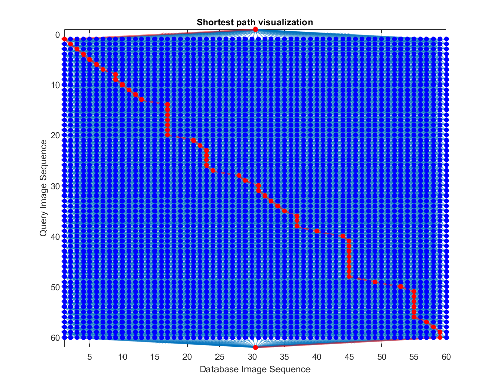

## Robust Visual Robot Localization Across Seasons using Network Flows
This is Matlab implementation of [Tayyab Naseer's](http://www2.informatik.uni-freiburg.de/~naseer/) paper on [Robust Visual Robot Localization Across Seasons using Network Flows](http://www2.informatik.uni-freiburg.de/~spinello/naseerAAAI14.pdf).

### Requirements
Requires Matlab R2015b or above for [digraph](http://www.mathworks.com/help/matlab/ref/digraph.html).
- Computer Vision System Toolbox for [extractHOGFeatures](http://www.mathworks.com/help/vision/ref/extracthogfeatures.html).

### How to Run?
Run the script `hog_mat.m` in the `src` folder.

I have code in `hog_mat.m` file that avoids repeated calculation of hog features if you make minor changes in the script. Manually use `clear hog_D`, `clear hog_Q` and `clear sMat` when you change the dataset so that hog features of the database, query and similarity matrix IS computer again.

### Limitations
This implimentation is without the hidden nodes.

### Results
#### Data Set 1
Note: The diagonal `x=y` is the ground truth.

#### Data Set 3
Note: The diagonal `x=y` is the ground truth.

